# SomniaPredict - System Architecture Diagrams

This document contains Mermaid diagrams illustrating the system architecture, user flows, and data relationships in SomniaPredict with Somnia Streams SDK integration.

## 🏗️ System Architecture

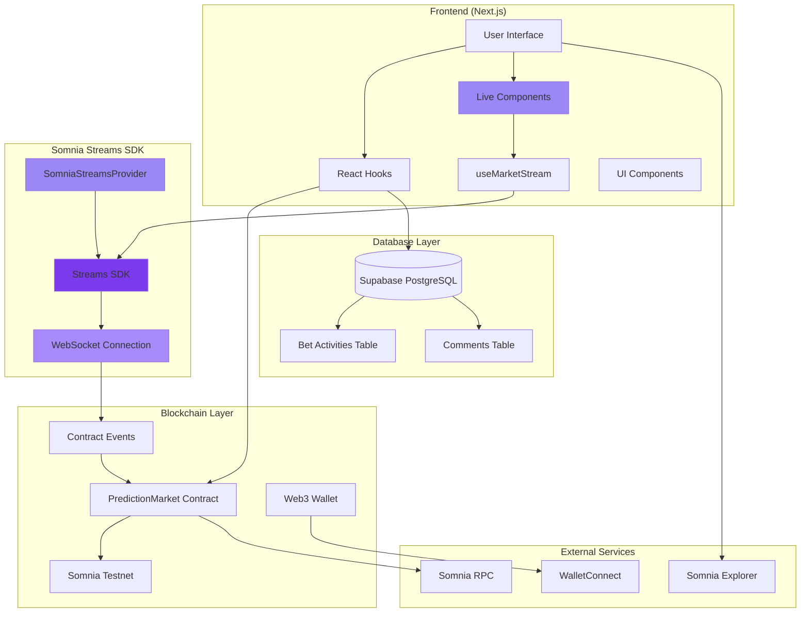

## 🔄 User Betting Flow

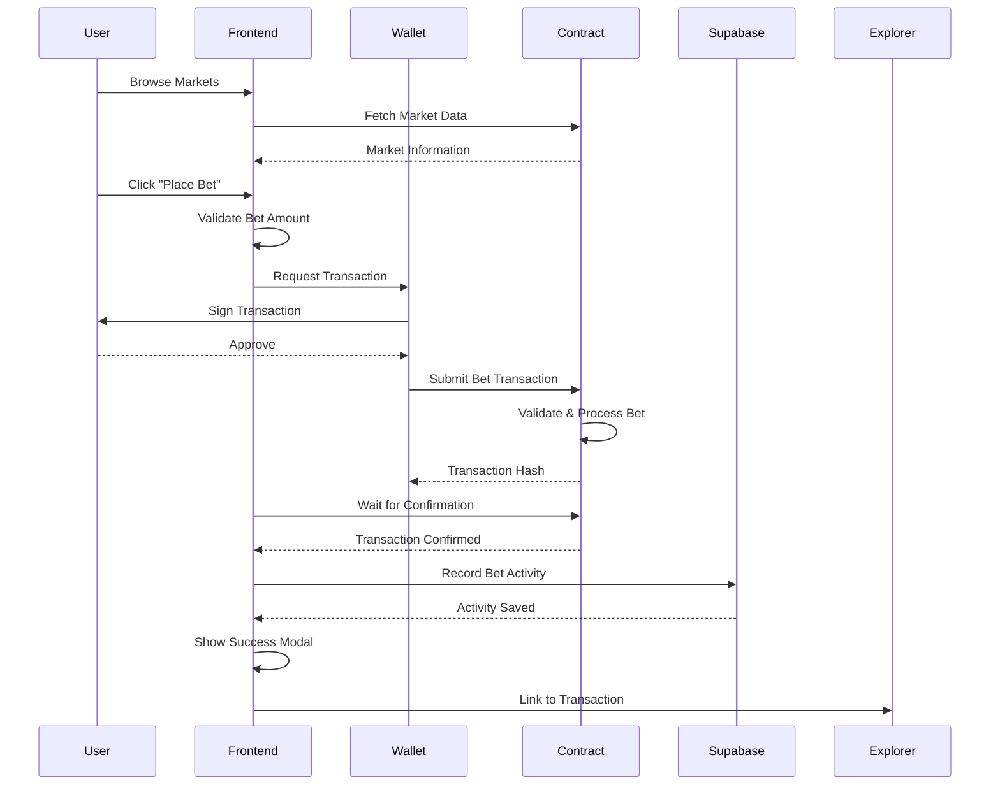

## 🎯 Market Lifecycle

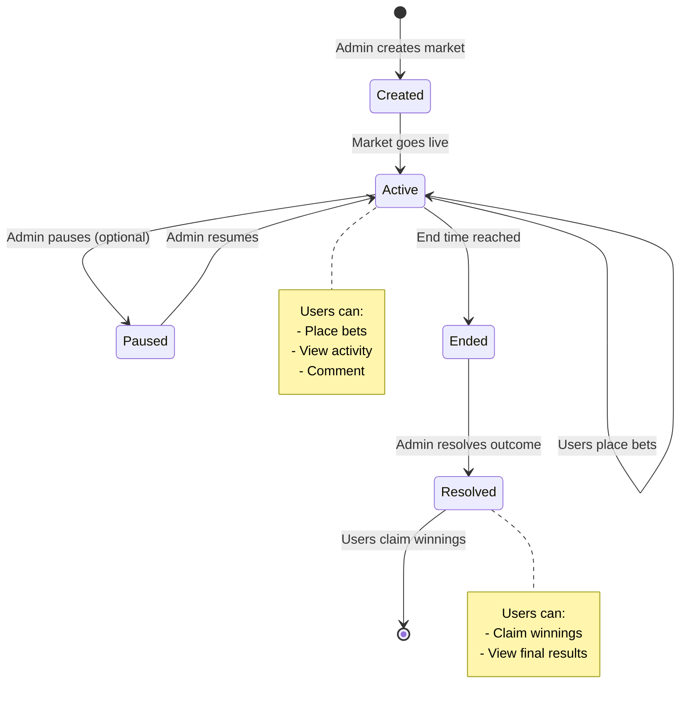

## 💰 Payout Calculation Flow

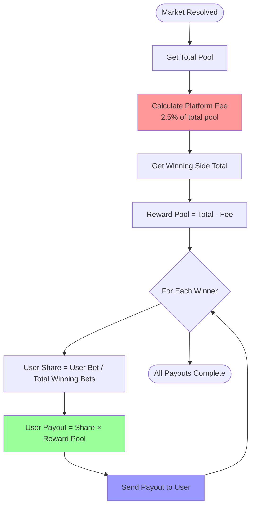

## 🗄️ Database Schema

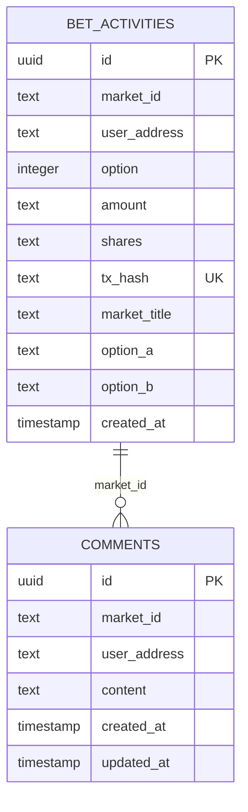

## 🔴 Somnia Streams Implementation

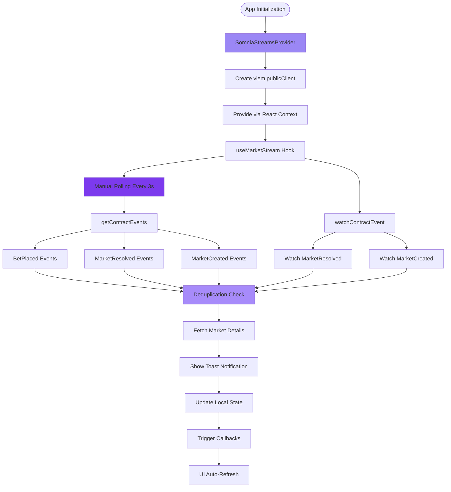

## 🔐 Authentication & Authorization Flow

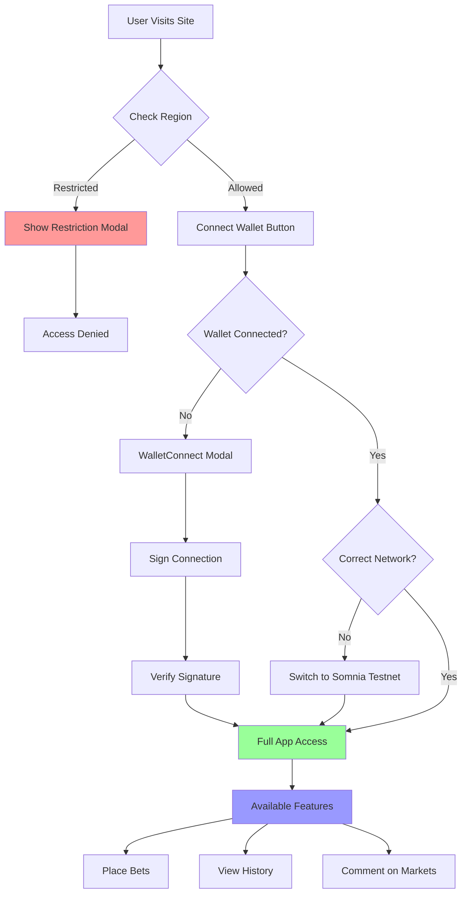

## 📊 Component Architecture

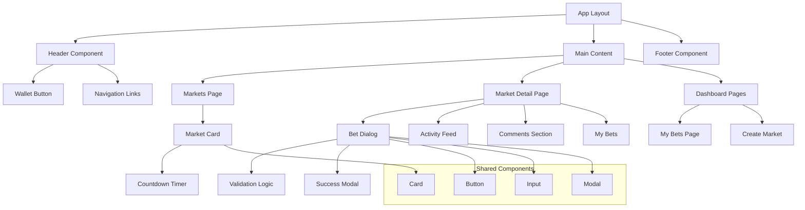

## 🔄 Real-time Data Flow

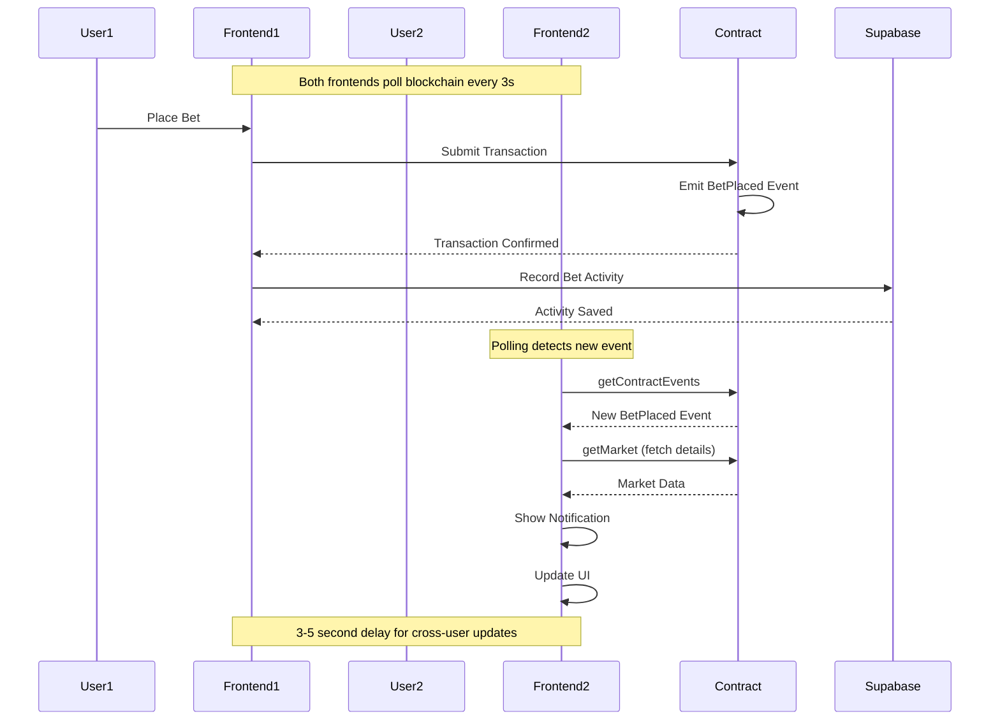

## 🎨 UI State Management

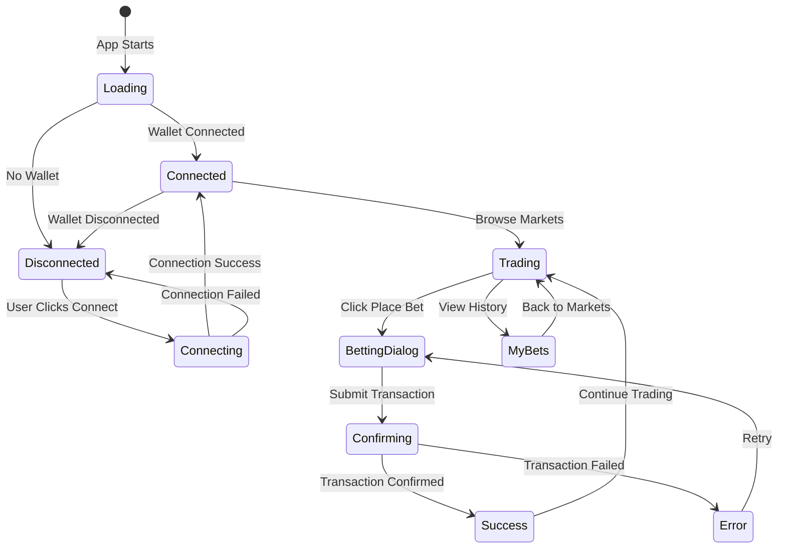

## 🚀 Deployment Architecture

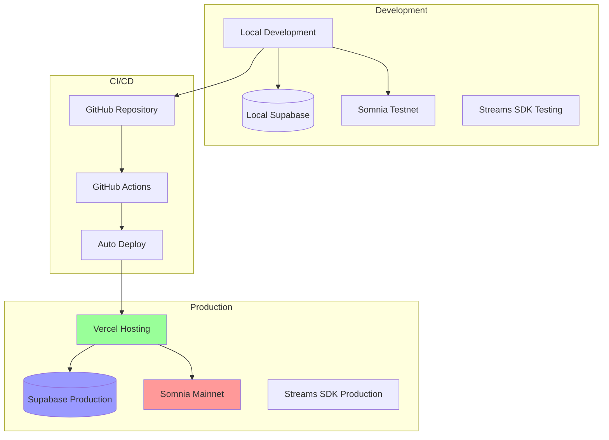

## 🎯 Event Monitoring Architecture

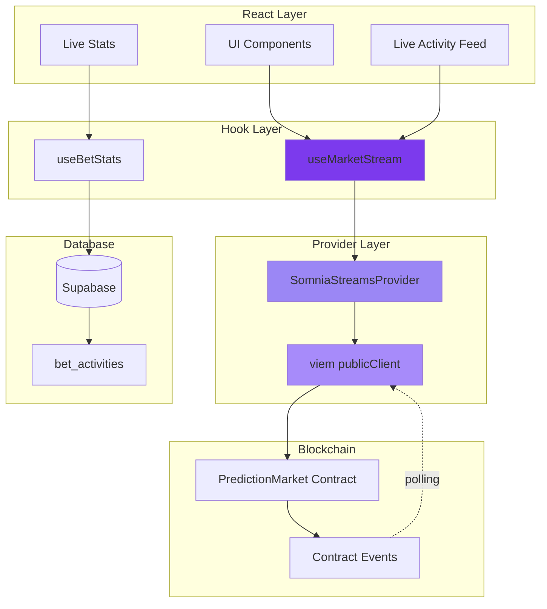

---

*These diagrams provide a comprehensive overview of the SomniaPredict system architecture, real-time data flows with Somnia Streams SDK, and component relationships. They serve as documentation for developers and stakeholders to understand the platform's technical implementation with WebSocket-based live updates.*