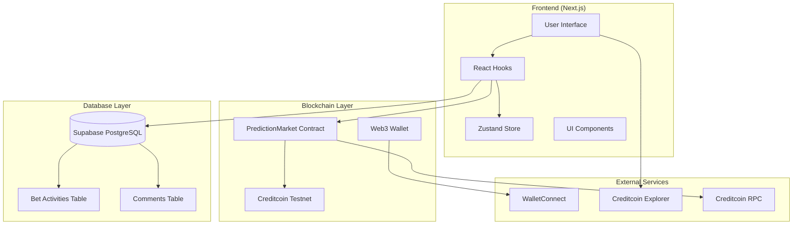
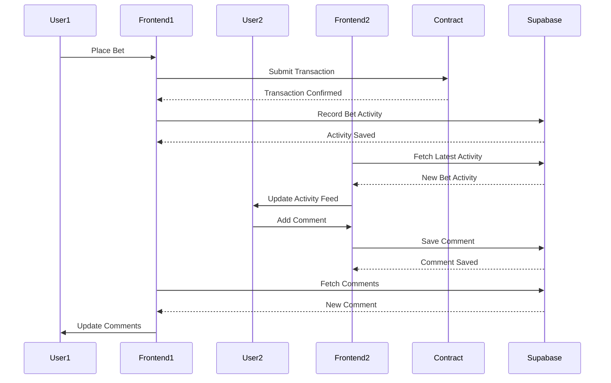
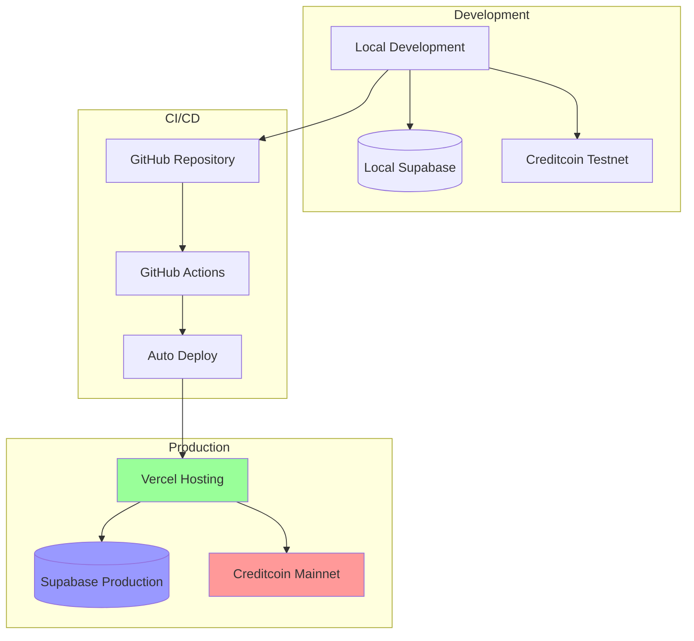

# Credit Predict - System Architecture Diagrams

This document contains Mermaid diagrams illustrating the system architecture, user flows, and data relationships in Credit Predict.

## 🏗️ System Architecture

## 🔄 User Betting Flow

## 🎯 Market Lifecycle

## 💰 Payout Calculation Flow

## 🗄️ Database Schema

## 🔐 Authentication & Authorization Flow

## 📊 Component Architecture

## 🔄 Real-time Data Flow

## 🎨 UI State Management

## 🚀 Deployment Architecture

---

*These diagrams provide a comprehensive overview of the Credit Predict system architecture, data flows, and component relationships. They serve as documentation for developers and stakeholders to understand the platform's technical implementation.*